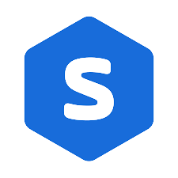

# Welcome on my github! 👋

***

Hi my name is *Tymon* and I'm an informatic student, who like challenges...

- Coding for 2 years 🕐
- Like doing web and algo stuff 🔧
- Like learning new things 👨🏽‍🎓
- 1000 days code challenge ***7% ✅***
- Looking for challenges 💪🏼

### [My projects](https://github.com/jasiukiewicztymon/jasiukiewicztymon/blob/main/My%20projects.md)
### [Skills](https://github.com/jasiukiewicztymon/jasiukiewicztymon/blob/main/Skills.md)

***

  
<h1>More<h1>

  

  
<h3>My activities</h3>

   
   

  
<h3>Languages I use...</h3>

   

  
## Languages and tools i use

  
<h3>Here you can find some of my profils</h3>

  
     
  
   

  
<h3>Some design and work technologies I use</h3>

  
  
  
   

  
<h3>Some programming languages and technologies I use</h3>

  
  
  
  
  
    

  ###

  
  
  
  
    

  ###

  
  
  
  
    

  ###

  
  
  
  

    

  

